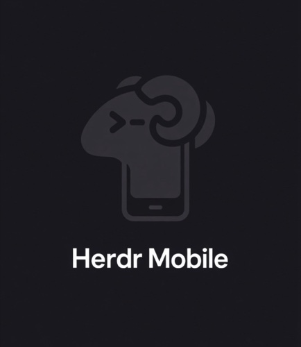
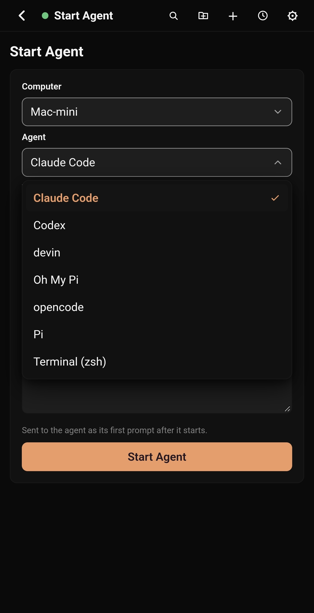
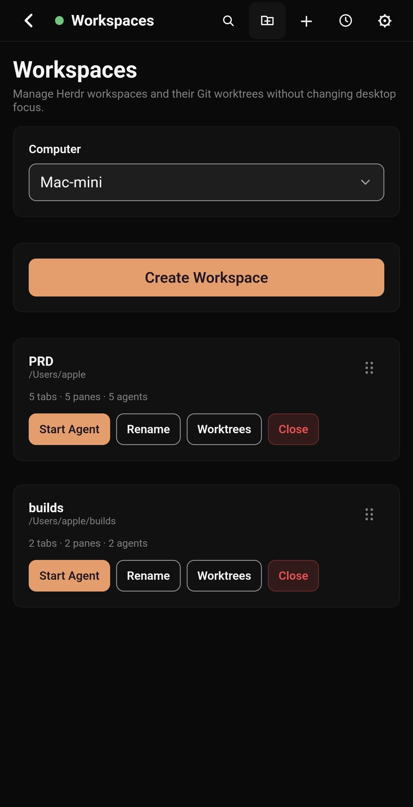
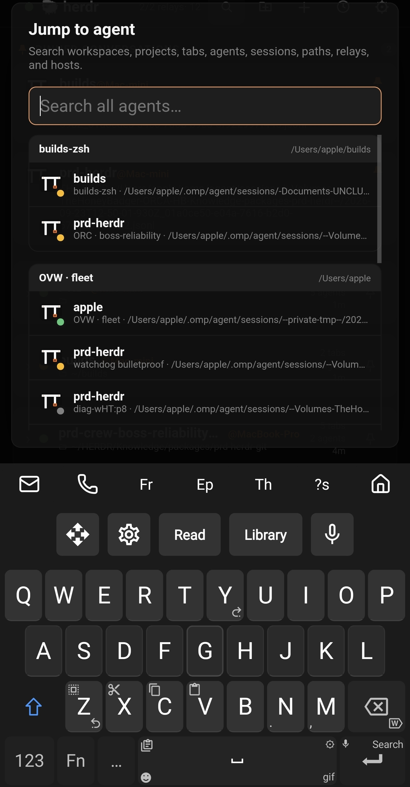
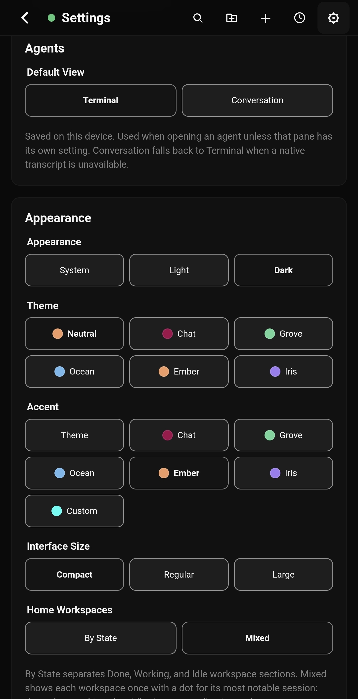

  

# Herdr Mobile Relay (fork)

> **This is a fork of [0cv/herdr-mobile-relay](https://github.com/0cv/herdr-mobile-relay).**
> All credit for the original project — the relay daemon, the gateway, the
> phone app, and the protocol — goes to the upstream author. This fork adds a
> set of personal UX polishes on top (see [Polishes in this fork](#polishes-in-this-fork)).
> If you want the maintained version with the free hosted option, use the
> [original repository](https://github.com/0cv/herdr-mobile-relay).

Control [Herdr](https://herdr.dev) coding agents from your phone. Each macOS or
Linux computer runs a small relay daemon; the phone connects to all of them and
merges every agent into one installable web app. You can watch agents work,
answer approvals and plan questions, send prompts and terminal keys, read
conversation history, manage workspaces and Git worktrees, and have responses
read aloud — all end-to-end encrypted.

  
  
  
  

## How it works

Three pieces cooperate:

1. **Relay daemon** — a single binary that runs on each computer you want to
   control. It talks to the local Herdr instance, reads agent state and
   terminal output, and serves the phone's commands. It only makes *outbound*
   connections; nothing needs to be reachable from the internet.
2. **Gateway** — a small WebSocket rendezvous service on a public host. The
   relay dials out to it and registers; the phone dials in and asks for that
   relay. The gateway copies already-encrypted frames between the two and holds
   no secrets: pairing keys never leave the relay, and the relay itself
   verifies each phone's challenge before the encrypted session starts. Where
   possible, phone and relay then negotiate a direct peer-to-peer WebRTC
   connection and the gateway drops back to signaling only.
3. **Phone app** — a static web app (HTML/JS/CSS) hosted anywhere. Open it in
   the phone's browser, "Add to Home Screen", and it behaves like a native app.
   Pairing is a one-time link or QR code that carries the relay's address and
   key; treat it as a secret.

Prompts, terminal output, uploads, and push details are encrypted end to end
between the phone and each relay. Whatever carries the traffic sees connection
metadata only, never plaintext.

## About this fork's deployment

The author of this fork runs their **own gateway and app hosting** — the app
and relay builds published from this repository are deployed to private
infrastructure and are not wired to the original project's hosted services.
The free hosted/community option (community gateway plus the upstream-hosted
app) lives in the [original repository](https://github.com/0cv/herdr-mobile-relay);
use that if you don't want to run any server yourself.

## Server setup (generic)

You need one small public host (any cheap VPS) and the computers you want to
control. An LLM agent or a human can follow these steps:

1. **Run a WebSocket gateway on the public host.** Build the gateway binary
   (`cmd/herdr-gateway` in this repo, or the `Dockerfile.gateway` image) and
   run it bound to loopback, e.g. `127.0.0.1:8443`. Put a TLS reverse proxy
   (Caddy, nginx, …) in front of it on a public name such as
   `wss://gateway.example.com`, forwarding the WebSocket upgrade headers.
   Open inbound UDP 3478 as well if you want the built-in address-discovery
   (STUN-like) listener that helps phones on cellular reach relays behind NAT.
   The gateway speaks plain HTTP internally; TLS terminates at the proxy.
2. **Install the relay daemon on each computer.** Build or install the relay
   (`cmd/herdr-mobile-relay`), point it at your gateway with
   `HERDR_GATEWAY_URL=wss://gateway.example.com`, and run it as a background
   service (systemd user unit on Linux, launchd agent on macOS — see
   `relay/` for the helper scripts). It registers with the gateway
   automatically and reconnects on failure.
3. **Host the phone app.** The app is a static bundle (the `web/` directory,
   produced by the frontend build). Serve it from any static host behind
   HTTPS — a second name on the same VPS, a Pages-style service, or an S3
   bucket all work, e.g. `https://app.example.com`.
4. **Pair the phone.** Run the relay's setup-link script (`relay/setup-link.sh`)
   or the setup menu to print a one-time setup link / QR code. Open it on the
   phone; the app stores the credential and connects. Each phone pairs as its
   own named device and can be revoked individually.

No inbound ports are needed on the controlled computers — only the gateway
host is public.

## Polishes in this fork

Everything upstream does, plus:

- **Pinned conversations** — pin any agent card to a dedicated section at the
  top of the home screen so the threads you care about never scroll away.
- **Pinned workspaces** — pin whole workspaces to the top as well; pinned
  groups keep their own ordering.
- **Drag-to-rearrange workspaces** — grab the handle on any workspace card
  and drop it where you want it; the order persists per device.
- **Per-relay default working directory** — set a default folder for each
  computer from Settings, or pin the current folder straight from the
  directory browser; new agents and the workspace manager start there.
- **Directory search/filter** — type in the folder picker to filter the
  listing, or type a path to jump straight to it.
- **Machine rename** — rename each connected computer to a friendly label
  from the phone.
- **Orange pin icons** — pinned items are marked with a distinct orange pin
  so they're recognizable at a glance.
- **Theme system** — six theme families (Neutral, Chat, Grove, Ocean, Ember,
  Iris), each with a real light and dark variant, plus a System/Light/Dark
  appearance picker that follows the OS.
- **Accent picker with custom color** — follow the theme's accent, pin one of
  the family accents across every theme, or dial in any hex with the built-in
  color picker.
- **Interface sizes** — Compact, Regular, and Large text densities; the whole
  layout (including the composer and settings grids) reflows to fit.
- **Voice dictation** — dictate prompts with the phone's speech recognizer;
  the composer stays editable and pauses don't kill the session.
- **Fixed header + keyboard-safe composer** — the header stays pinned and the
  terminal composer survives the mobile on-screen keyboard without covering
  the input or leaving dead space.
- **Terminal shell profile + direct typing** — launch a plain shell (e.g.
  zsh) as a terminal, and toggle direct-input mode to send keystrokes live
  instead of buffered lines, so interactive TUIs like fuzzy finders work.
- **Read responses aloud, your way** — pick the relay's synthesized neural
  voices *or* the phone's own text-to-speech engine, with a playback-speed
  slider.
- **Distinct history error codes** — conversation-history failures report
  specific codes (e.g. `history_unavailable` vs `history_failed`) instead of
  one generic error, so the app can react and retry appropriately.
- **Self-update reads this fork's releases** — the updater checks
  `demetre19/herdr-mobile` for new versions by default, so an upstream
  release can never overwrite the fork's patches. `HERDR_UPDATE_REPO`
  overrides the feed for development or staging (`owner/repo`).

## Documentation

The upstream docs in `docs/` still apply to everything not listed above —
transports, gateway self-hosting detail, security model, and the full feature
tour. Start with [QUICKSTART.md](QUICKSTART.md) and
[docs/mobile-app.md](docs/mobile-app.md).

## License

[GNU Affero General Public License v3.0 or later](LICENSE), same as upstream.
